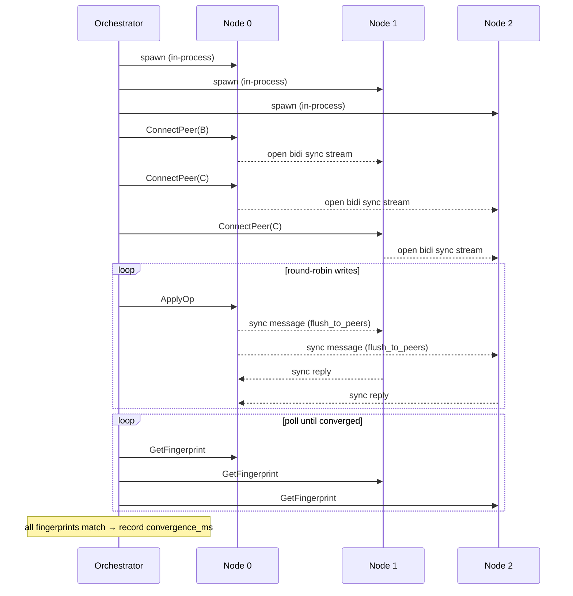
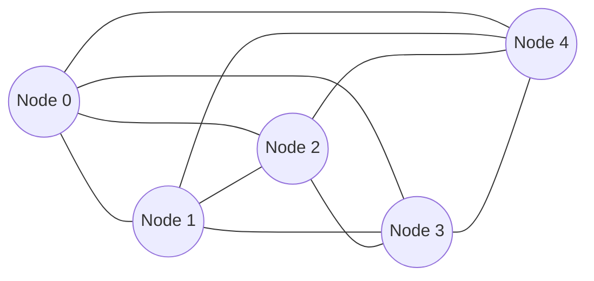
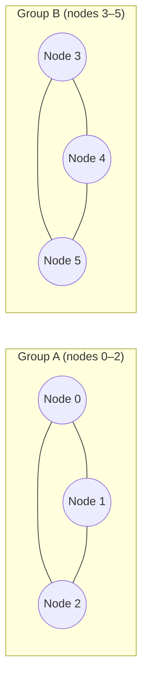
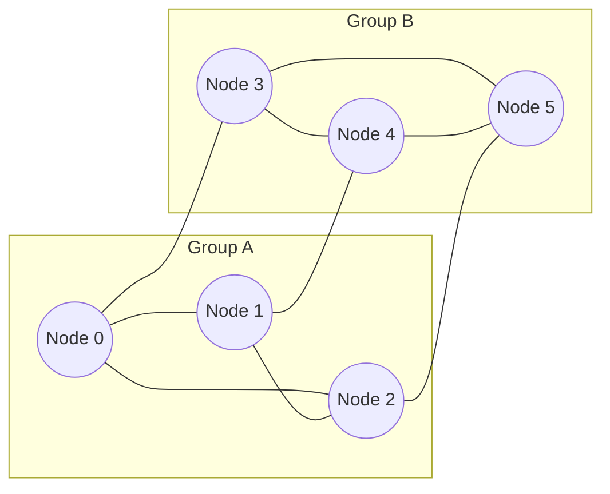

# Replicant

A CRDT benchmarking framework built on [Automerge](https://automerge.org/) and gRPC. Replicant spins up replica nodes, drives sync workloads between them, and collects latency/throughput metrics via OpenTelemetry.

## Crates

| Crate | Role |
|---|---|
| `common` | Protobuf-generated types and shared gRPC stubs |
| `replica` | Automerge replica with a gRPC server and OTel metrics export |
| `orchestrator` | Launches replicas, drives workloads, and runs the smoke test |

## Quick start

```sh
just          # list all available recipes
just smoke    # run the three built-in regression scenarios (2, 3, and 4 nodes)
just ci       # full gate: fmt check → lint → test → smoke
just docs     # build and open rustdoc
```

## Requirements

- Rust (stable, edition 2024)
- [`just`](https://github.com/casey/just)
- `protoc` (Protocol Buffers compiler)

## Scenarios

### Orchestration flow

The orchestrator runs all replicas as in-process Tokio tasks (no subprocesses).
Each node exposes two gRPC services: `Replica` for control-plane RPCs and `Sync`
for peer-to-peer Automerge sync streams.



### Full-mesh topology

All nodes are connected to every other node before writes begin.
`flush_to_peers` after each local op delivers changes in one hop.



### Partition-heal topology

Nodes are split into groups that are fully connected internally. Each group
writes independently, accumulating divergent history. The heal step adds
cross-group edges; `convergence_ms` is measured from that point.

**Partitioned (writes in progress):**



**After heal (cross-group edges added):**


