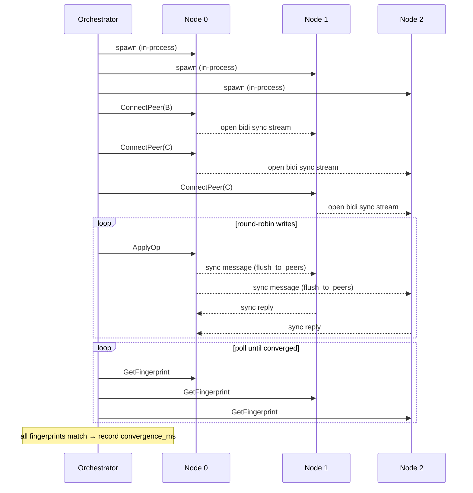
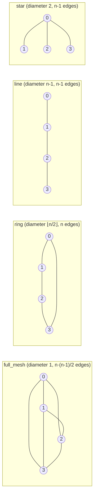
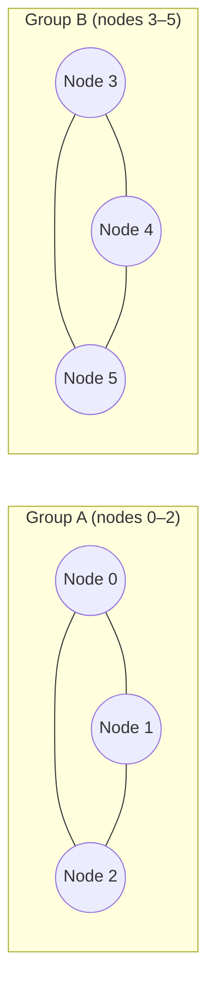
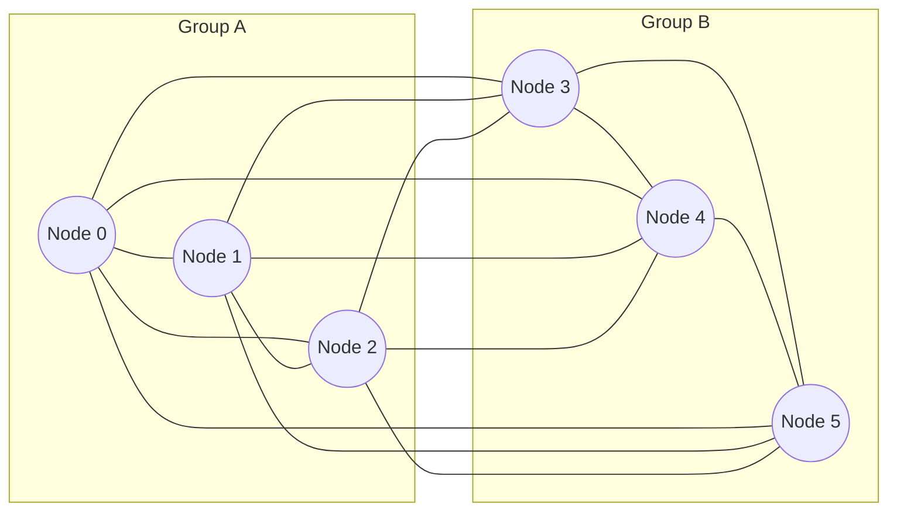
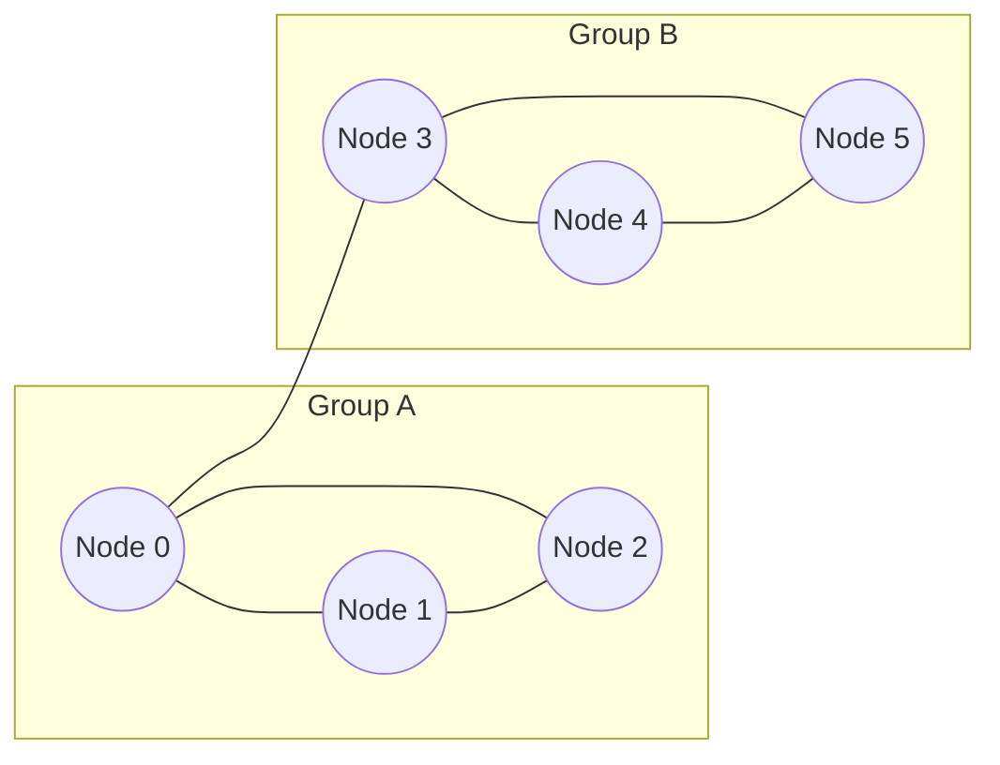
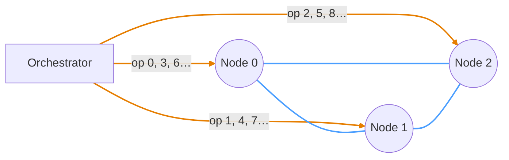
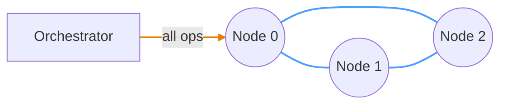

# Replicant

```
 ____  _____ ____  _     ___ ____    _    _   _ _____
|  _ \| ____|  _ \| |   |_ _/ ___|  / \  | \ | |_   _|
| |_) |  _| | |_) | |    | | |     / _ \ |  \| | | |
|  _ <| |___|  __/| |___ | | |___ / ___ \| |\  | | |
|_| \_\_____|_|   |_____|___\____/_/   \_\_| \_| |_|
```

> *"All those moments will be lost in time, like tears in rain..."*
> — Roy Batty, *Blade Runner* (1982)
>
> ...unless you measure them.

A CRDT benchmarking framework built on [Automerge](https://automerge.org/) and gRPC. Replicant spins up replica nodes, drives sync workloads between them, and collects latency/throughput metrics via OpenTelemetry.

## Crates

| Crate | Role |
|---|---|
| `common` | Protobuf-generated types and shared gRPC stubs |
| `replica` | Automerge replica with a gRPC server and OTel metrics export |
| `orchestrator` | Launches replicas, drives workloads, and runs the smoke test |

## Quick start

In-process (no Docker needed; the fastest path for local development):

```sh
just          # list all available recipes
just smoke    # run the three built-in regression scenarios (2, 3, and 4 nodes)
just ci       # full gate: fmt check → lint → test → smoke
just docs     # build and open rustdoc
```

## Containerized run

The orchestrator can drive a stack of containerized replicas wired to a real OTel collector and Prometheus. Two runtimes are supported: docker compose (single host) and a local kind cluster (k8s, single host). Both run the same replica image; only the recipe and wiring differ.

`--replicas` accepts comma-separated `client_addr[=peer_addr]` entries — the first is what the orchestrator dials, the second (defaults to the first when omitted) is what each replica passes to its peers in `ConnectPeer`. The two diverge whenever replicas live in a different network namespace from the orchestrator. When `--replicas` is set, the orchestrator accepts only one scenario and one trial per invocation since replica state persists between runs — bounce the stack to reset.

### docker compose

`just smoke-docker` is the one-liner end-to-end check:

```sh
just smoke-docker    # builds the replica image, brings up 5 replicas +
                     # otel-collector + prometheus, runs full-mesh-n5
                     # against them, tears the stack down
```

For longer interactive sessions, drive the stack manually:

```sh
docker compose -f deploy/docker/compose.yaml up -d --build
# Prom UI: http://localhost:9090
cargo run --release --bin orchestrator -- \
  --replicas localhost:50051=replica-0:50051,localhost:50052=replica-1:50051,localhost:50053=replica-2:50051,localhost:50054=replica-3:50051,localhost:50055=replica-4:50051 \
  scenarios/full-mesh-n5.toml
docker compose -f deploy/docker/compose.yaml down
```

Wiring: the orchestrator on the host reaches replicas via published ports (`localhost:5005N`); containers resolve each other via service DNS (`replica-N:50051`).

### kind cluster (local k8s)

`just smoke-k8s` brings up a single-host kind cluster, applies the manifests in `deploy/k8s/overlays/kind`, port-forwards the 5 replica pods to host ports `50051..50055`, runs full-mesh-n5, and tears the cluster down:

```sh
just smoke-k8s                    # build → kind create → load → apply →
                                  # port-forwards → orchestrator → teardown
KEEP_KIND=1 just smoke-k8s        # preserve the cluster for debugging
```

Manifests are organised as Kustomize bases under `deploy/k8s/base/` with overlay-specific patches under `deploy/k8s/overlays/`. The same image runs in both runtimes (no separate "k8s build"). Replica pods are a `StatefulSet` for stable identity (`node-0`…`node-4` matching the actor scheme) — they are not stateful for storage, and `kubectl rollout restart statefulset/node -n replicant` is the one-liner to clear all state.

## Analysis

The Jupyter notebook at `analysis/convergence.ipynb` produces figures from benchmark data.

**Offline path** (file-based metrics, no docker daemon): generate `results/results.csv` and per-scenario metrics files under `results/`, then open the notebook. The two passes are separate because OTel counters accumulate across scenarios in a single invocation, so per-scenario attribution needs one invocation per scenario:

```sh
mkdir -p results

# 1. Unified sweep across all scenarios for results/results.csv (timing/percentile tables).
cargo run --release --bin orchestrator -- --trials 10 --output csv \
  scenarios/*.toml \
  2>/dev/null > results/results.csv

# 2. Per-scenario results/metrics-<scenario>.json files (sync/op/doc-size protocol data).
for s in $(ls scenarios/*.toml | xargs -n1 basename -s .toml); do
  cargo run --release --bin orchestrator -- --trials 10 \
    --metrics-file "results/metrics-${s}.json" \
    "scenarios/${s}.toml" \
    > /dev/null 2>&1
done

cd analysis && jupyter lab convergence.ipynb
```

The notebook caches parsed data as `results/results.parquet` and refreshes when `results/results.csv` is newer. The `results/` directory is gitignored.

**Live path** (Prometheus-backed): bring up the containerized stack (`just smoke-docker` or the manual flow above), then run the notebook's "Prometheus-backed metrics (live stack)" section. It queries the running Prom directly via PromQL — useful for ad-hoc inspection and to assert the structural invariant that all replicas converge to the same `doc_size_bytes`.

## Requirements

- Rust (toolchain pinned via `rust-toolchain.toml` to 1.95.0; rustup auto-installs)
- [`just`](https://github.com/casey/just)
- `protoc` (Protocol Buffers compiler)
- Docker + Compose v2 (optional, for `smoke-docker`)
- [`kind`](https://kind.sigs.k8s.io/) + `kubectl` (optional, for `smoke-k8s`)

## Scenarios

### Orchestration flow

By default the orchestrator runs all replicas as in-process Tokio tasks (no
subprocesses); with `--replicas` it instead connects to externally-managed
replicas (e.g. the docker-compose stack above). Either way each node exposes
two gRPC services: `Replica` for control-plane RPCs and `Sync` for
peer-to-peer Automerge sync streams.



### Topology variants

Scenario TOML files set `connections = "full_mesh" | "ring" | "line" | "star"` for the named topologies, or `connections = { edges = [[0,1], ...] }` for arbitrary custom graphs. `recv_loop` relays inbound state to all other connected peers after each merge, so non-mesh topologies converge through intermediate hops.



> **Headline finding** (Phase D, release build, 10 trials): diameter alone does **not** predict convergence. Full-mesh-n10 (diameter 1, 45 edges) is the *slowest* at ~42 ms/op; line-n10 (diameter 9, 9 edges) is the *fastest* at ~9 ms/op. Convergence ≈ f(edge_count, max_degree, write_pattern) ≫ f(diameter). See the notebook's "Convergence vs diameter" and "Sync traffic per write op" sections.

### Partition-heal topology

Nodes are split into groups that are fully connected internally. Each group
writes independently, accumulating divergent history. The heal step adds
cross-group edges; `convergence_ms` is measured from that point.

The `heal_topology` field in `[partition_heal]` selects what gets reconnected:

- **`heal_topology = "full_mesh"`** (default, omittable) — every cross-group pair gets an edge; post-heal graph is `K_n`.
- **`heal_topology = "bridge"`** — only one edge is added, between `groups[0].nodes[0]` and `groups[1].nodes[0]`. Requires exactly 2 groups.

**Partitioned (writes in progress):**



**After `heal_topology = "full_mesh"` — every cross-group edge added:**



**After `heal_topology = "bridge"` — single edge between `groups[0].nodes[0]` and `groups[1].nodes[0]`:**



The bridge variant forces all cross-partition state through one edge. With far fewer cross-edges flooding (1 vs N²/4), bridge heal is **7-21× faster** than full-mesh heal in the n=4-8 scenarios — same edges-vs-diameter mechanism as the line-vs-full-mesh steady-state result above. See the notebook's "Partition-heal" section.

### Write patterns

Two write distributions are supported via the `write_pattern` field in scenario
TOML files. Bundled scenarios cover both patterns across every topology — see
the `-concentrated` suffix on filenames in [scenarios/](scenarios/).

**`round_robin`** — ops cycle through all nodes in scope:



**`concentrated`** — all ops go to node 0:



> **Orange** = write op (orchestrator → node) &nbsp; **Blue** = Automerge sync connection (node ↔ node)
