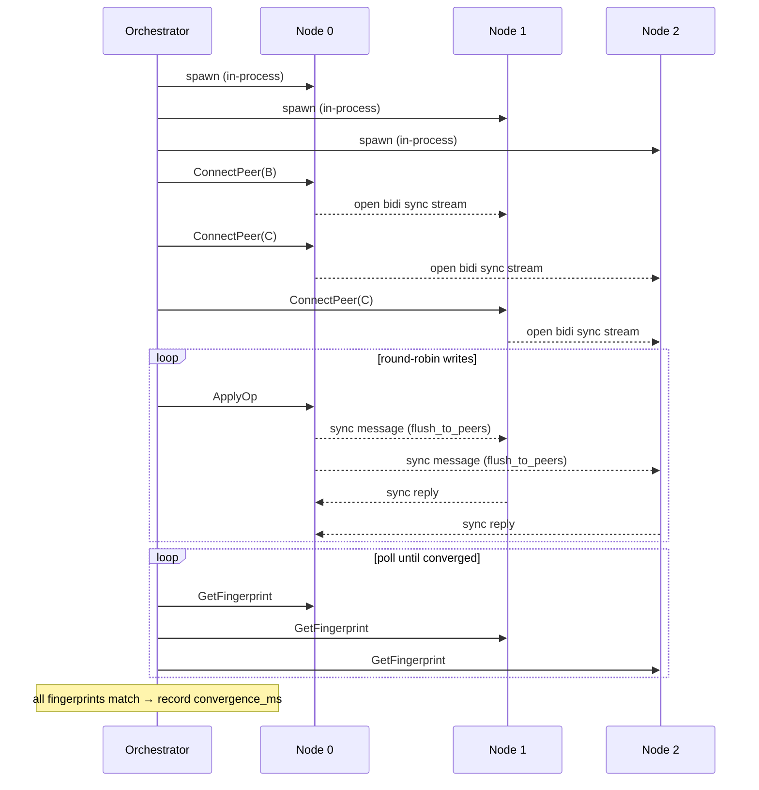
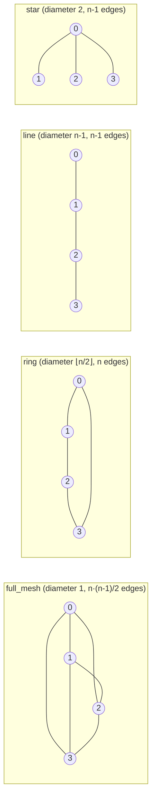
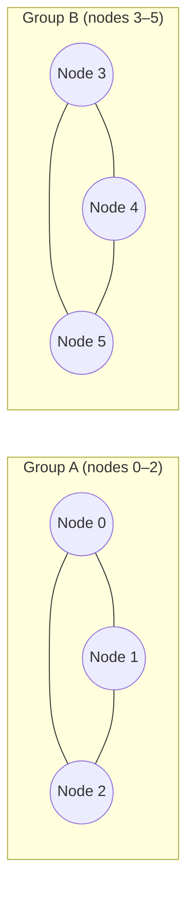
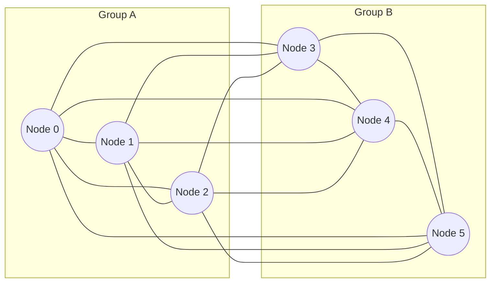
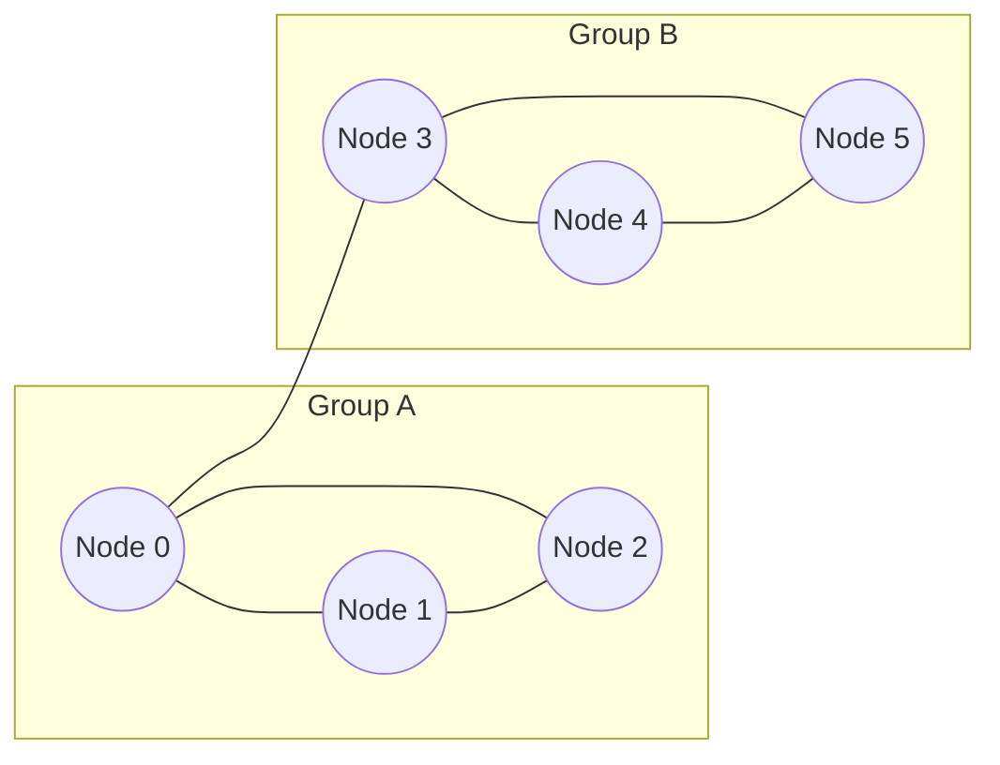
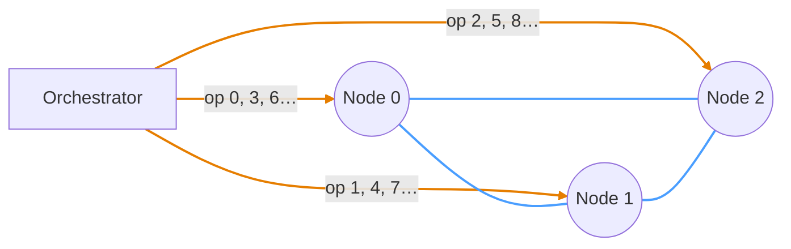
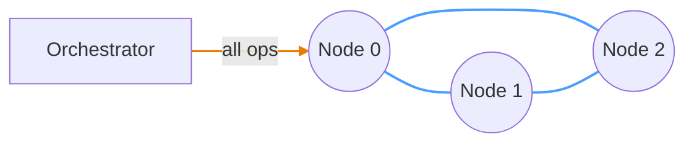

# Replicant

```
 ____  _____ ____  _     ___ ____    _    _   _ _____
|  _ \| ____|  _ \| |   |_ _/ ___|  / \  | \ | |_   _|
| |_) |  _| | |_) | |    | | |     / _ \ |  \| | | |
|  _ <| |___|  __/| |___ | | |___ / ___ \| |\  | | |
|_| \_\_____|_|   |_____|___\____/_/   \_\_| \_| |_|
```

> *"All those moments will be lost in time, like tears in rain..."*
> — Roy Batty, *Blade Runner* (1982)
>
> ...unless you measure them.

[](https://github.com/exokernel/replicant/actions/workflows/ci.yml)

A CRDT benchmarking framework built on [Automerge](https://automerge.org/) and gRPC. Replicant spins up replica nodes, drives sync workloads between them, and collects latency/throughput metrics via OpenTelemetry.

> [!IMPORTANT]
> **Work in progress.** Replicant is an early-stage research framework. Any specific numbers or patterns surfaced by the notebooks are descriptions of what one or two sweeps produced on a single host — not claims about CRDT performance in general. Treat figures as illustrative; see [TODO.md](TODO.md) for the framework gaps (second CRDT backend, statistical rigor, multi-host) that need to land before any of it would be defensible as more than that.

## Crates

| Crate | Role |
|---|---|
| `common` | Protobuf-generated types and shared gRPC stubs |
| `replica` | Automerge replica with a gRPC server and OTel metrics export |
| `orchestrator` | Launches replicas, drives workloads, and runs the smoke test |

## Quick start

In-process (no Docker needed; the fastest path for local development):

```sh
just          # list all available recipes
just smoke    # run the three built-in regression scenarios (2, 3, and 4 nodes)
just ci       # full gate: fmt check → lint → test → smoke → scenario-grid check
just docs     # build and open rustdoc
```

## Containerized run

The orchestrator can drive a stack of containerized replicas wired to a real OTel collector and Prometheus. Two runtimes are supported: docker compose (single host) and a local kind cluster (k8s, single host). Both run the same replica image; only the recipe and wiring differ.

`--replicas` accepts comma-separated `client_addr[=peer_addr]` entries — the first is what the orchestrator dials, the second (defaults to the first when omitted) is what each replica passes to its peers in `ConnectPeer`. The two diverge whenever replicas live in a different network namespace from the orchestrator.

Replica state is cleared between trials and between scenarios via a `Replica.Reset` RPC, so a single orchestrator invocation against an externally-managed stack can sweep multiple scenarios with `--trials N` — no need to bounce containers/pods between runs. The `just bench-docker` and `just bench-k8s` recipes wrap this: one stack per distinct `node_count` bucket, Reset between trials within a bucket, output to `results/results-{docker,k8s}.csv` for the analysis notebooks plus a `results-{docker,k8s}.meta.json` provenance file (see [Run provenance](#run-provenance)).

### docker compose

`just smoke-docker` is the one-liner end-to-end check:

```sh
just smoke-docker    # builds the replica image, brings up 5 replicas +
                     # otel-collector + prometheus + grafana, runs
                     # full-mesh-n5 against them, tears the stack down
```

For longer interactive sessions, leave the stack running:

```sh
just docker-up scenarios/full-mesh-n5.toml      # build → up; stays running
# Grafana:    http://localhost:3000  (admin/admin)
# Prometheus: http://localhost:9090

# Run one or many scenarios (Replica.Reset clears state between trials and
# between scenarios — no container bounce needed):
cargo run --release --bin orchestrator -- --trials 10 \
  --replicas localhost:50051=replica-0:50051,localhost:50052=replica-1:50051,localhost:50053=replica-2:50051,localhost:50054=replica-3:50051,localhost:50055=replica-4:50051 \
  scenarios/full-mesh-n5.toml scenarios/star-n5.toml

# Or use the sweep recipe (wraps stack lifecycle + Reset + CSV emit):
just bench-docker "scenarios/*-n5*.toml" 10      # writes results/results-docker.csv

just docker-reset                               # wipe Prometheus + replica
                                                # state, keep Grafana edits
just docker-down                                # tear down
```

Wiring: the orchestrator on the host reaches replicas via published ports (`localhost:5005N`); containers resolve each other via service DNS (`replica-N:50051`). The compose YAML is regenerated per scenario from [`deploy/docker/gen-compose.py`](deploy/docker/gen-compose.py); configs for otel-collector and prometheus live in [`deploy/shared/`](deploy/shared/) and are bind-mounted by compose / loaded as ConfigMaps in k8s, so both stacks read the same source.

### kind cluster (local k8s)

`just smoke-k8s` brings up a single-host kind cluster, applies the manifests in `deploy/k8s/overlays/kind`, port-forwards the 5 replica pods to host ports `50051..50055`, runs full-mesh-n5, and tears the cluster down:

```sh
just smoke-k8s                    # build → kind create → load → apply →
                                  # port-forwards → orchestrator → teardown
KEEP_KIND=1 just smoke-k8s        # preserve the cluster for debugging
```

For longer interactive sessions:

```sh
just k8s-up scenarios/full-mesh-n5.toml         # idempotent: rescales in place;
                                                # also sets up the per-pod
                                                # `localhost:5005N` port-forwards
                                                # in the background so the
                                                # orchestrator can dial each pod
just k8s-ui                                     # foreground port-forwards:
                                                # Grafana :3000, Prometheus :9090
just k8s-reset                                  # wipe Prometheus + replica
                                                # state, keep Grafana edits
just k8s-down                                   # tear down

# Multi-trial sweep (uses Replica.Reset, no pod bounces):
just bench-k8s "scenarios/*-n5*.toml" 10        # writes results/results-k8s.csv
```

Manifests are organised as Kustomize bases under `deploy/k8s/base/` with overlay-specific patches under `deploy/k8s/overlays/`. The same image runs in both runtimes (no separate "k8s build"). Replica pods are a `StatefulSet` for stable identity (`node-0`…`node-4` matching the actor scheme) — they are not stateful for storage.

### Dashboards

Both stacks ship with a provisioned Grafana dashboard at [`deploy/shared/grafana/dashboards/replicant.json`](deploy/shared/grafana/dashboards/replicant.json) — four panels covering document size convergence, op latency p50/p95, sync messages tx/rx per actor, and sync edge inventory. Reachable at `http://localhost:3000` (admin/admin) when the stack is up via `docker-up` or `k8s-ui`. The dashboard is editable in-browser; edits persist across container restarts and across `*-reset` (which only wipes Prometheus tsdb + replica state), and are wiped by `*-down` if you want a fully clean slate. Useful for live debugging and demos; the analysis notebooks (especially [`analysis/convergence.ipynb`](analysis/convergence.ipynb)) remain the source of truth for the numbers that go into the write-up.

## Analysis

Four Jupyter notebooks under `analysis/`, one per question — see [`analysis/README.md`](analysis/README.md) for the pointer table:

- [`convergence.ipynb`](analysis/convergence.ipynb) — CSV-driven plots. Pick `SOURCE = "in_process" | "docker" | "k8s"`.
- [`protocol_metrics.ipynb`](analysis/protocol_metrics.ipynb) — OTel JSON files (in-process only — see notebook header for why).
- [`live_metrics.ipynb`](analysis/live_metrics.ipynb) — live PromQL on a running stack.
- [`comparison.ipynb`](analysis/comparison.ipynb) — cross-source view; default `INCLUDE = ["docker", "k8s"]`.

**Offline path** (CSV from a finished sweep, no live stack required): three CSVs feed the notebooks depending on `SOURCE`:

```sh
mkdir -p results

# in_process — same orchestrator process as the replicas. Cheapest, but
# round_robin on relay-heavy topologies is artifactually slow here; see
# analysis/comparison.ipynb.
cargo run --release --bin orchestrator -- --trials 10 --output csv \
  scenarios/*.toml > results/results.csv

# docker / k8s — externally-managed stacks, multi-scenario + multi-trial via
# the Replica.Reset RPC. The recipes own the stack lifecycle (one stack per
# distinct node_count bucket) and write the per-source CSV the notebook reads.
just bench-docker "scenarios/*.toml" 10                  # results/results-docker.csv
just bench-k8s    "scenarios/*.toml" 10                  # results/results-k8s.csv

# Per-scenario OTel JSON for protocol_metrics.ipynb (in_process only — one
# invocation per scenario so counters don't accumulate across scenarios):
for s in $(ls scenarios/*.toml | xargs -n1 basename -s .toml); do
  cargo run --release --bin orchestrator -- --trials 10 \
    --metrics-file "results/metrics-${s}.json" --output csv \
    "scenarios/${s}.toml" > /dev/null 2>&1
done

cd analysis && jupyter lab
```

Each CSV is cached alongside it as `<stem>.parquet` and refreshed when the CSV is newer. The `results/` directory is gitignored.

**Live path** (Prometheus-backed): bring up a containerized stack (`just docker-up` or `just k8s-up` + `just k8s-ui`), run a scenario against it (typically a paced one — see [`scenarios/full-mesh-n5-paced.toml`](scenarios/full-mesh-n5-paced.toml)), then open `analysis/live_metrics.ipynb` and Run All. It queries Prometheus directly via PromQL — useful for live demos and for asserting the structural invariant that all replicas converge to the same `doc_size_bytes`.

## Requirements

- Rust (toolchain pinned via `rust-toolchain.toml` to 1.97.0; rustup auto-installs)
- [`just`](https://github.com/casey/just)
- `protoc` (Protocol Buffers compiler)
- Docker + Compose v2 (optional, for `smoke-docker`)
- [`kind`](https://kind.sigs.k8s.io/) + `kubectl` (optional, for `smoke-k8s`)

## Scenarios

### Orchestration flow

By default the orchestrator runs all replicas as in-process Tokio tasks (no
subprocesses); with `--replicas` it instead connects to externally-managed
replicas (e.g. the docker-compose stack above). Either way each node exposes
two gRPC services: `Replica` for control-plane RPCs and `Sync` for
peer-to-peer Automerge sync streams.



### Topology variants

Scenario TOML files set `connections = "full_mesh" | "ring" | "line" | "star"` for the named topologies, or `connections = { edges = [[0,1], ...] }` for arbitrary custom graphs. `recv_loop` relays inbound state to all other connected peers after each merge, so non-mesh topologies converge through intermediate hops.



### Partition-heal topology

Nodes are split into groups that are fully connected internally. Each group
writes independently, accumulating divergent history. The heal step adds
cross-group edges; `convergence_ms` is measured from that point — which means
it necessarily includes opening those sync streams. The `wiring_ms` column
reports that portion so it can be subtracted; see
[`docs/metrics.md`](docs/metrics.md#wiring_ms-the-part-of-the-window-that-isnt-merge-cost).

The `heal_topology` field in `[partition_heal]` selects what gets reconnected:

- **`heal_topology = "full_mesh"`** (default, omittable) — every cross-group pair gets an edge; post-heal graph is `K_n`.
- **`heal_topology = "bridge"`** — only one edge is added, between `groups[0].nodes[0]` and `groups[1].nodes[0]`. Requires exactly 2 groups.

**Partitioned (writes in progress):**



**After `heal_topology = "full_mesh"` — every cross-group edge added:**



**After `heal_topology = "bridge"` — single edge between `groups[0].nodes[0]` and `groups[1].nodes[0]`:**



The bridge variant forces all cross-partition state through one edge. With far fewer cross-edges flooding (1 vs N²/4), bridge heal is **7-21× faster** than full-mesh heal in the n=4-8 scenarios — same edges-vs-diameter mechanism as the line-vs-full-mesh steady-state result above. See the notebook's "Partition-heal" section.

### Write patterns

Two write distributions are supported via the `write_pattern` field in scenario
TOML files. Bundled scenarios cover both patterns across every topology — see
the `-concentrated` suffix on filenames in [scenarios/](scenarios/).

**`round_robin`** — ops cycle through all nodes in scope:



**`concentrated`** — all ops go to node 0:



> **Orange** = write op (orchestrator → node) &nbsp; **Blue** = Automerge sync connection (node ↔ node)

### Text workloads and the divergence grid

The `workload` field selects what each write does: `map_put` (default — every
pre-existing scenario) or `text_splice`, which exercises the sequence-CRDT
path. For partition-heal text scenarios the `locality` field sets where each
insert lands, drawn per-op against the issuing replica's own text length:

- **`append`** — insert at the end (`pos = len`). Low-contention floor.
- **`random_position`** — uniform in `[0, len]`. Exercises positional access.
- **`same_region`** — always `pos = 0`, so every op contests the same anchor.
  Maximal contention.

Positions come from a per-replica seeded PRNG (`seed = f(cell, replica,
trial)`, hand-rolled SplitMix64), so the op stream is bit-identical across
runs and across CRDT adapters — the seeds are recorded in the run-provenance file
(below). The `divergence-n2-*` scenario family is a 12-cell grid of
{1e2..1e5} ops-per-side × the three localities, modeling two replicas editing
offline and then merging: partition-heal with singleton groups, so
`convergence_ms` is the heal-to-merge time. The cells are generated, not
hand-written — `just gen-scenarios` writes them and `just check-scenarios`
(part of `just ci`) fails if a file drifts from its generator.

Two correctness mechanisms back text workloads, both born of a real bug
(replicas that diverge from an empty document each lazily created a *private*
text object; the heal then resolved a map-key conflict and silently discarded
one side's entire text — while fingerprints converged):

- **Shared-object bootstrap** (`Replica.EnsureText`): before any edges are
  wired, every replica authors a bit-identical bootstrap change (fixed actor,
  time 0) creating the text object, so all replicas share one object identity
  without any sync.
- **Post-convergence validity gate** (`Replica.GetTextLength`): after every
  text trial the runner asserts final text length == total ops on every node,
  outside the measurement window. Fingerprint equality proves the replicas
  agree; only this proves they agree on a document containing all the work.

### Run provenance

`--provenance PATH` writes a JSON run-provenance record next to the results: git
commit + dirty flag, host, build profile, node source (in-process vs
external), per-cell parameters, every per-(trial, node) PRNG seed, and the
cell's achieved contention (concurrent-siblings-per-anchor, simulated from
the same seeded draws the runner uses). `--dry-run` emits the provenance file without
running trials. The `bench-docker` / `bench-k8s` recipes write it
automatically as `results/results-{docker,k8s}.meta.json`. Sweeps worth
citing are archived with their provenance files under the tracked [`data/`](data/)
directory (e.g. [`data/divergence-pilot-2026-08-06/`](data/divergence-pilot-2026-08-06/));
`results/` remains gitignored scratch.

## AI assistance

This project is developed with substantial AI assistance (Anthropic's Claude),
used for code, experiment tooling, and analysis. The author reviews the work
produced this way with the goal of understanding and being able to defend every
line, and treats AI output with the same skepticism as any other untrusted
input: design decisions are questioned rather than accepted, measurements are
cross-checked (see the validity gates and [run provenance](#run-provenance)
above), and results that look plausible are still verified against the
underlying systems before being believed. Responsibility for the code, the
methodology, and any claims made from the data rests with the author.
